# 📐 클래스 다이어그램: 풍림화산 전쟁 (Elemental War)

> 실제 구현 코드 기준 구조도입니다.
> 가독성을 위해 **시스템별로 다이어그램을 분리**했으며, 각 다이어그램에는 핵심 멤버만 표기했습니다.

**설계의 세 가지 축**

1. **씬 단위 MVC 분리**: 5개 씬 전체에서 `BaseSceneController` / `BaseUIManager` / `NetworkManager`가 각각 로직, 화면, 통신만 담당
2. **패턴 기반 확장**: Composite, State, Adapter, Strategy, Registry를 문제 상황별로 선택 적용해 기능 추가 시 기존 코드 수정 최소화(OCP)
3. **네트워크 경계의 국소화**: 게임 로직은 네트워크를 모르고, `UnitNetworkSync` · `NetworkPoolManager`만 Photon PUN2에 의존

### 📑 목차

| # | 다이어그램 | 내용 |
|---|---|---|
| 0 | [전체 구조 개요](#0-전체-구조-개요) | 시스템 간 의존 관계 맵 |
| 1 | [Core 공통 기반](#1-core-공통-기반) | `Singleton<T>`, `BaseSceneController<T>`, `BaseUIManager<T>`, `UIPanel` |
| 2 | [씬 MVC 구조](#2-씬-mvc-구조) | 5개 씬의 Controller, View, Network 3계층 |
| 3 | [유닛 시스템 (Component)](#3-유닛-시스템-component) | `Unit` 퍼사드 & 기능별 컴포넌트 |
| 4 | [유닛 상태 머신 (State)](#4-유닛-상태-머신-state) | `IUnitState` 5종 & 상태 전이 |
| 5 | [애니메이터 계층 (Adapter)](#5-애니메이터-계층-adapter) | 3종 서드파티 에셋 통합 |
| 6 | [네트워크 & 오브젝트 풀](#6-네트워크--오브젝트-풀) | `IPunPrefabPool` 및 RPC 동기화 |
| 7 | [데이터 계층](#7-데이터-계층) | `UnitStat`, `UnitDatabase`, `DeckModel` |
| 8 | [UI 계층 (Composite)](#8-ui-계층-composite) | Manager → Container → Item |
| 9 | [채팅 시스템 (Strategy)](#9-채팅-시스템-strategy) | `IChatTransport` 교체형 전송 |
| 10 | [맵 · 성 · 대포 · 에너지](#10-맵--성--대포--에너지) | 전투 자원과 승패 판정 |
| 11 | [프로파일링 계층](#11-프로파일링-계층-계측-빌드-전용) | `ENABLE_PROFILING` 전용 계측 인프라 |
| 12 | [이벤트 & RPC 흐름](#12-이벤트--rpc-흐름) | 발행/구독 및 네트워크 전파 경로 |

---

## 0. 전체 구조 개요

세부 클래스는 생략하고 **시스템 단위의 의존 방향**만 표현했습니다.

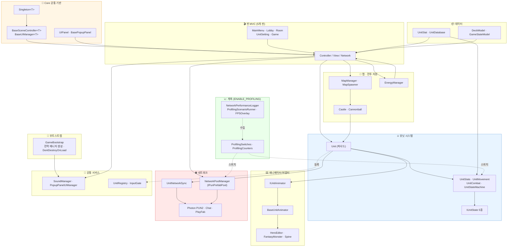

---

## 1. Core 공통 기반

모든 씬이 공유하는 기반 계층입니다. **Template Method 패턴**으로 초기화, 구독, 해제 순서를 강제해, 씬이 늘어나도 생명주기 처리 누락이 발생하지 않도록 했습니다.

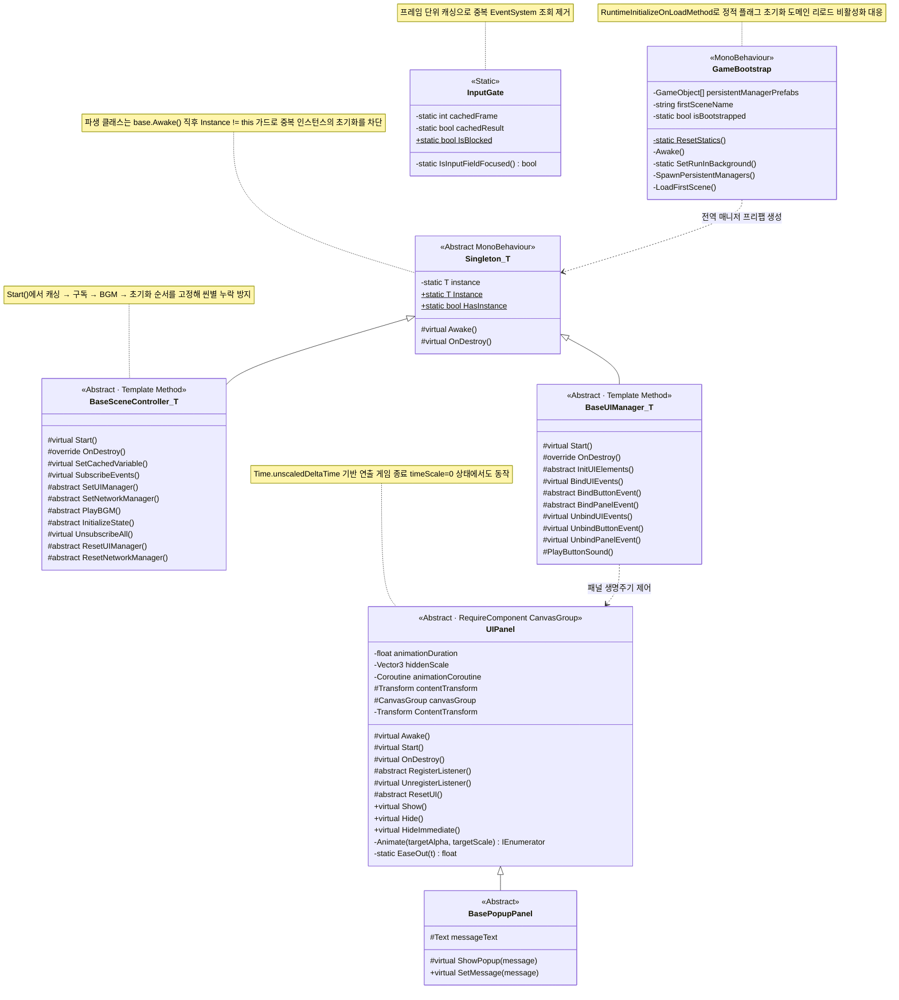

---

## 2. 씬 MVC 구조

5개 씬(MainMenu, Lobby, Room, UnitSetting, Game) 모두 동일한 3계층 구조를 따릅니다.
**Network는 Photon 콜백만 이벤트로 승격**하고, **UI는 화면 출력만** 담당하며, **로직과 상태는 Controller에만** 존재합니다.

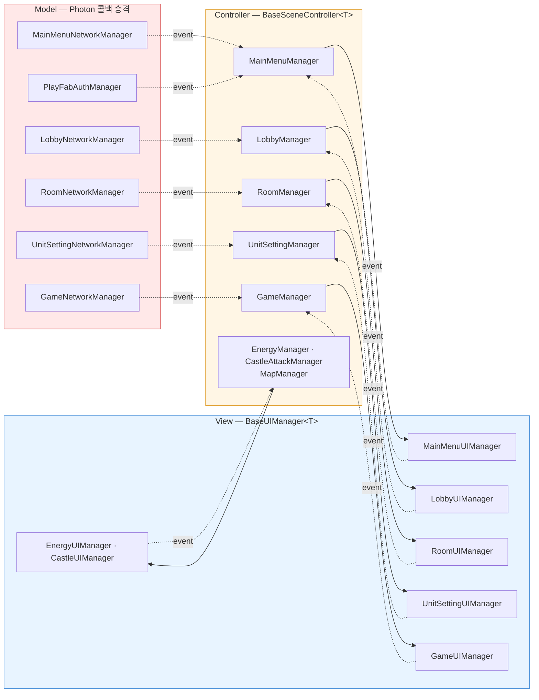

> **`EnergyManager` · `CastleAttackManager` · `MapManager`는 씬 컨트롤러가 아닌 Game 씬의 서브시스템**입니다.
> 캐싱 → 구독 → 초기화 → 해제 생명주기를 동일하게 요구하므로 `BaseSceneController<T>`를 재사용했으며,
> 네트워크 콜백과 BGM이 불필요한 클래스는 해당 훅을 빈 구현으로 남겼습니다.

---

## 3. 유닛 시스템 (Component)

`Unit`은 로직을 직접 구현하지 않고 **기능별 컴포넌트에 위임하는 퍼사드**입니다.
`[RequireComponent]`로 필수 컴포넌트 누락을 막고, `[DisallowMultipleComponent]`로 중복 부착을 차단합니다.

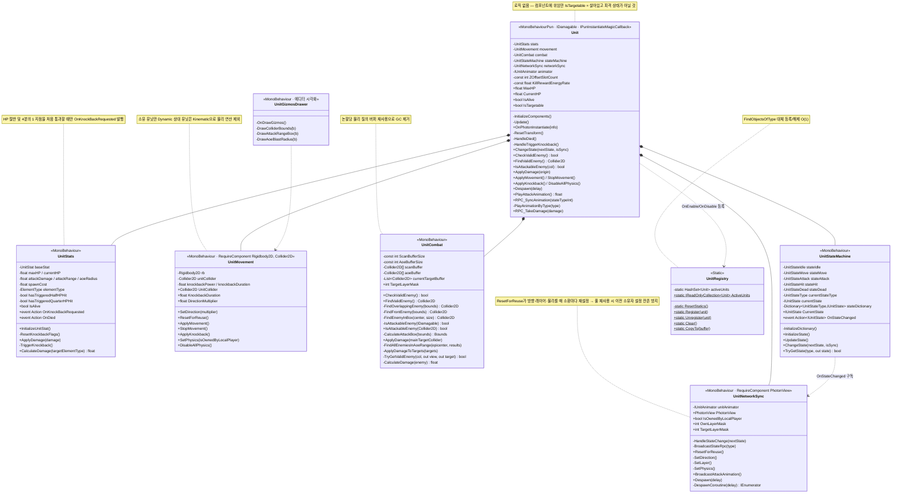

---

## 4. 유닛 상태 머신 (State)

행동을 `if` / `switch`가 아닌 **독립 클래스**로 분리했습니다. 상태를 추가할 때 기존 분기문을 수정할 필요가 없습니다.
각 상태는 `MonoBehaviour`가 아닌 `[Serializable]` 순수 클래스여서 인스펙터에서 내부 값을 그대로 관찰할 수 있습니다.

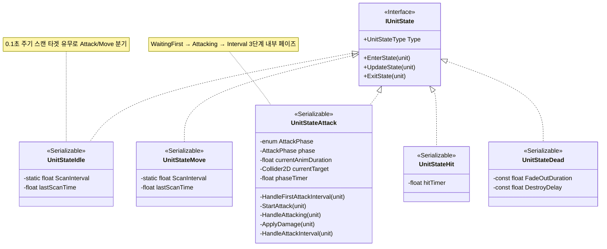

### 상태 전이 흐름

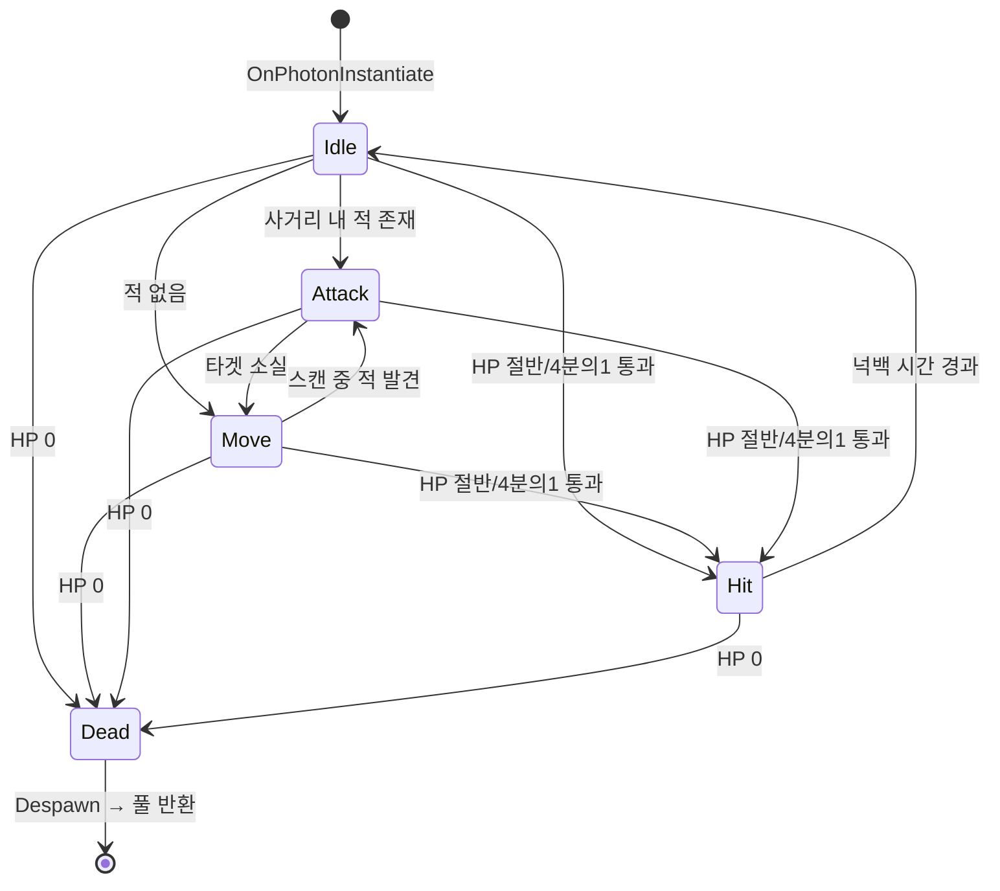

---

## 5. 애니메이터 계층 (Adapter)

리소스 한계로 **내부 API가 전혀 다른 3종의 서드파티 유닛 에셋**을 함께 사용해야 했습니다.
공통 인터페이스로 변환해, 유닛 시스템이 에셋 종류를 전혀 알지 못하도록 격리했습니다.

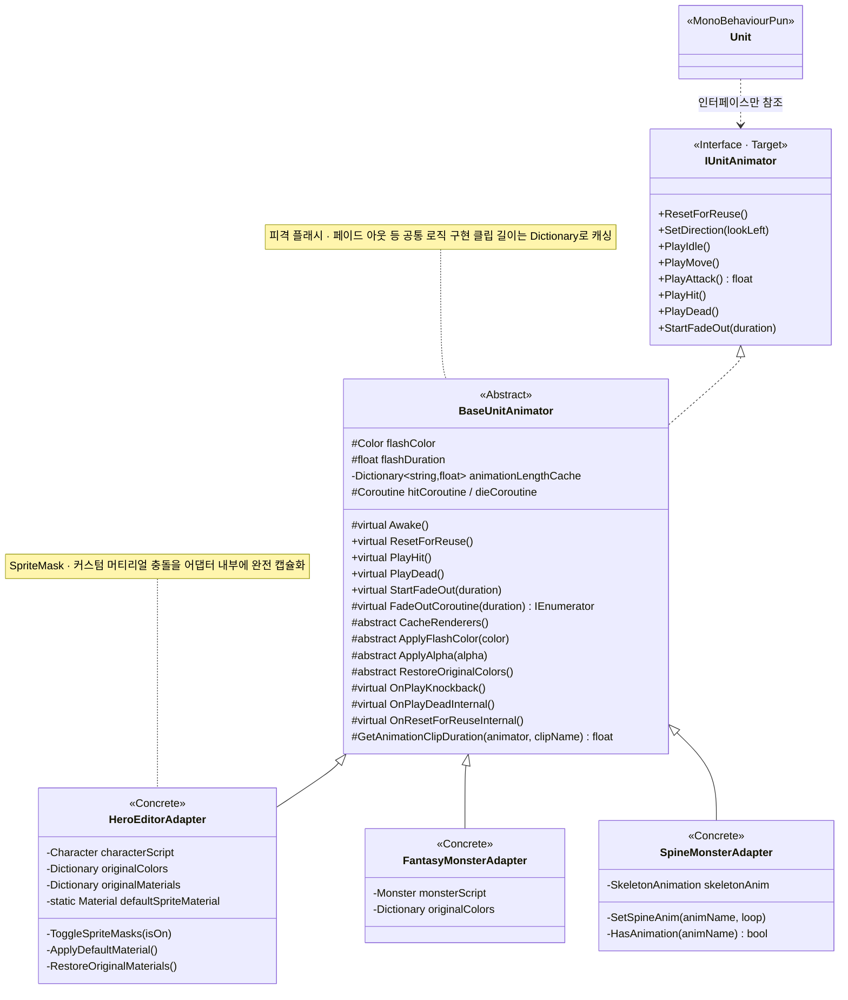

---

## 6. 네트워크 & 오브젝트 풀

Photon 의존성이 **`UnitNetworkSync`와 `NetworkPoolManager` 두 곳에만** 존재하도록 경계를 좁혔습니다.
상태 머신은 네트워크를 전혀 알지 못하고, 상태 변경 이벤트만 발행합니다.

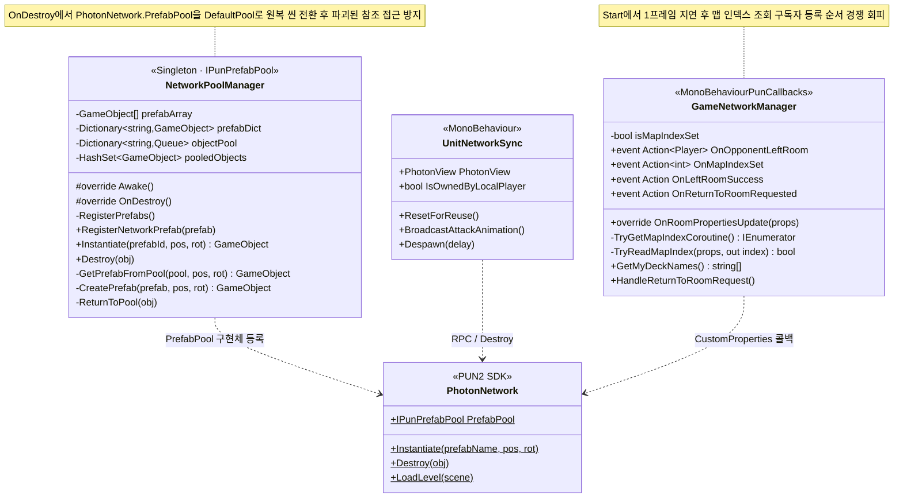

### 유닛 생성, 동기화, 소멸 경로

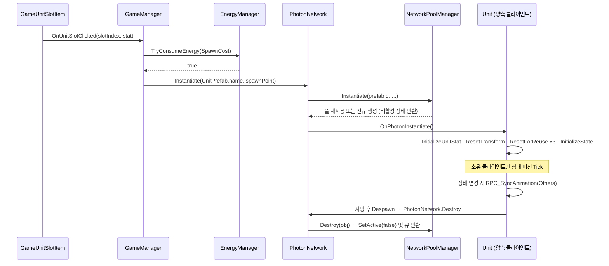

---

## 7. 데이터 계층

로직과 데이터를 분리해, **유닛 추가 시 코드 수정 없이 에셋 파일만 생성**하면 시스템에 반영되도록 했습니다(OCP).

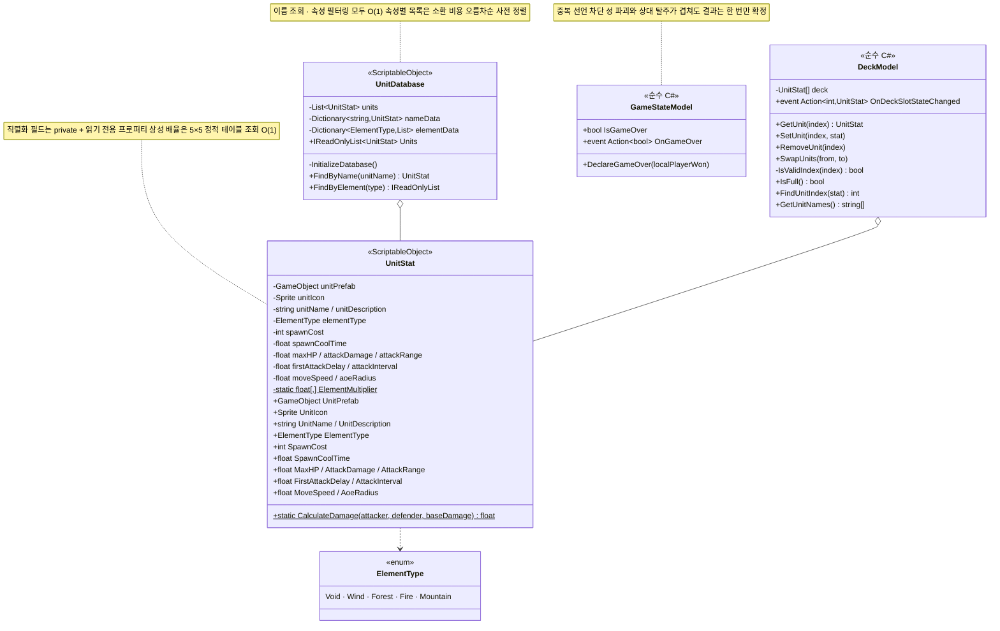

---

## 8. UI 계층 (Composite)

단일 아이템과 복합 컨테이너를 동일한 방식으로 다뤄, 슬롯 개수와 무관하게 최상위 Manager 한 곳에서 제어합니다.

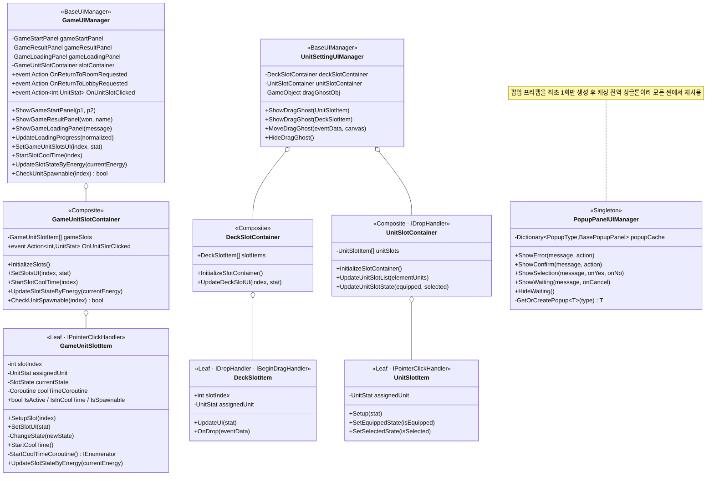

**이벤트 버블링 경로**

```
GameUnitSlotItem (클릭)
   → GameUnitSlotContainer (집계)
      → GameUIManager (View)
         → GameManager (Controller에서만 실제 소환 판정)
```

---

## 9. 채팅 시스템 (Strategy)

로비 채팅과 방 채팅은 **전송 방식이 완전히 다릅니다**(Photon Chat SDK vs. RPC 브로드캐스트).
전송을 인터페이스로 추상화해, `ChatController`는 구체 방식을 모른 채 씬에 따라 구현체만 교체됩니다.

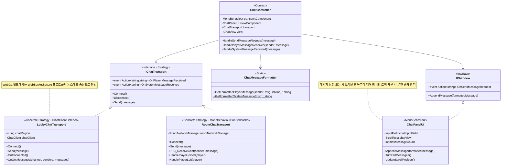

---

## 10. 맵 · 성 · 대포 · 에너지

맵 생성부터 승패 판정까지의 Game 씬 서브시스템입니다.

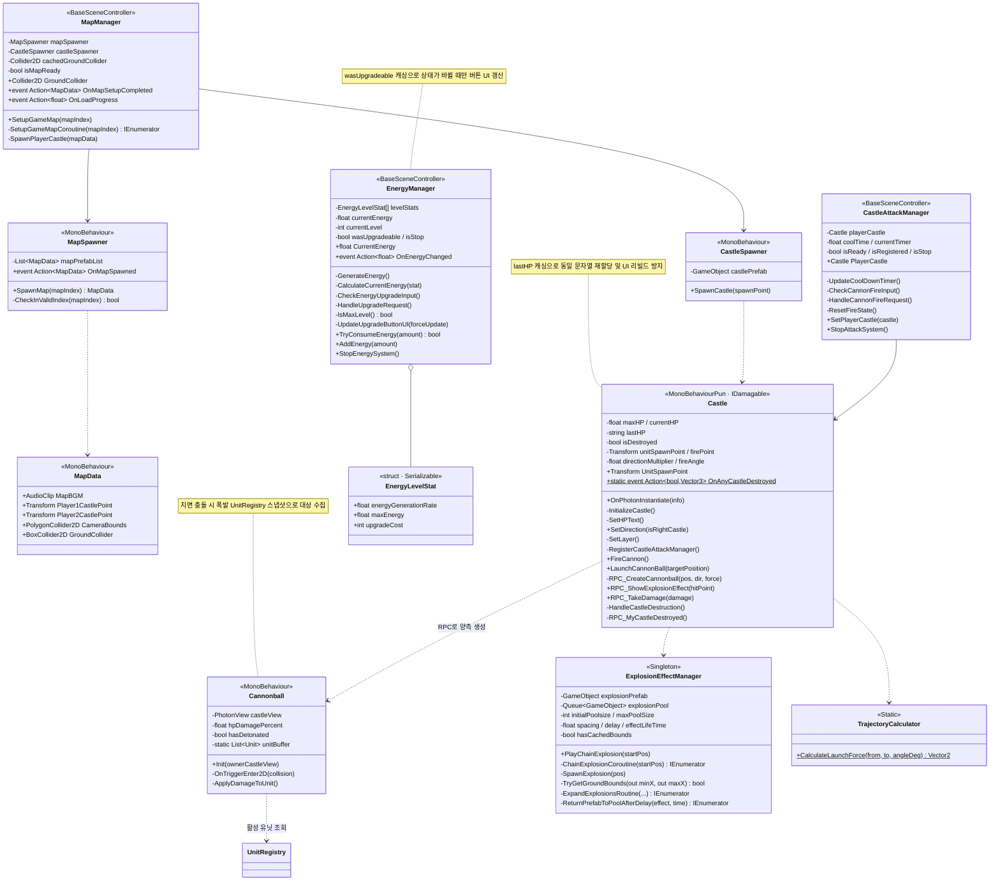

---

## 11. 프로파일링 계층 (계측 빌드 전용)

최적화 판단을 감이 아닌 계측으로 하기 위한 인프라입니다.
**`ENABLE_PROFILING` 심볼이 없으면 전 항목이 컴파일 단계에서 제거**되어, 배포 빌드에는 한 줄도 남지 않습니다.

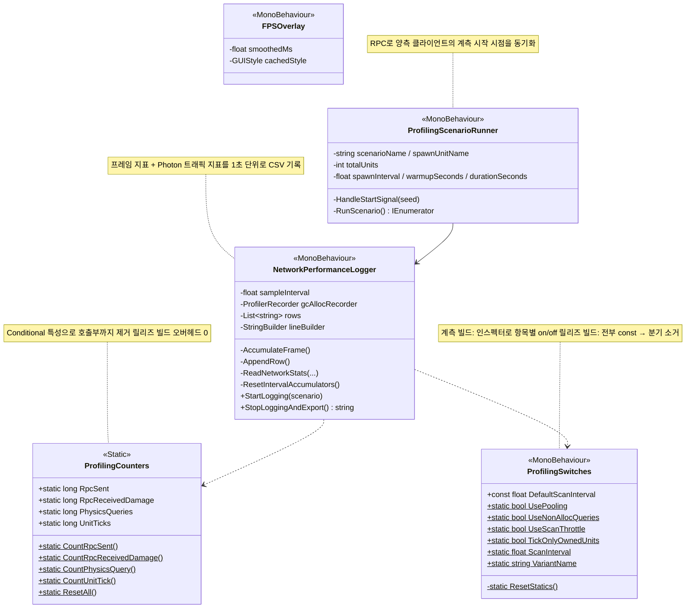

---

## 12. 이벤트 & RPC 흐름

시스템 간 직접 참조를 최소화하기 위해 **C# 이벤트**로 내부를 연결하고, 클라이언트 간에는 **PUN2 RPC / CustomProperties**로 전파합니다.

```mermaid
flowchart TD
    subgraph LOCAL["로컬 이벤트 (C# event)"]
        E1["UnitStats.OnDied"] --> H1["Unit.HandleDied<br/>→ Dead 상태 + 에너지 회수"]
        E2["UnitStats.OnKnockBackRequested"] --> H2["Unit.HandleTriggerKnockback<br/>→ Hit 상태"]
        E3["UnitStateMachine.OnStateChanged"] --> H3["UnitNetworkSync.HandleStateChange"]
        E4["Castle.OnAnyCastleDestroyed<br/>(static)"] --> H4["GameManager.HandleGameResult"]
        E5["GameStateModel.OnGameOver"] --> H5["GameManager.HandleGameOverState"]
        E6["EnergyManager.OnEnergyChanged"] --> H6["GameUIManager.UpdateSlotStateByEnergy"]
        E7["GameUIManager.OnUnitSlotClicked"] --> H7["GameManager.HandleUnitSpawnRequest"]
        E8["MapManager.OnMapSetupCompleted"] --> H8["GameManager.HandleMapSetupCompleted"]
        E9["DeckHotkeyHandler.OnSlotHotkeyPressed"] --> H9["GameManager.HandleHotkeyUnitSpawn"]
    end

    subgraph NETWORK["네트워크 전파 (PUN2)"]
        R1["Unit.RPC_SyncAnimation<br/>RpcTarget.Others"]
        R2["Unit.RPC_TakeDamage<br/>RpcTarget.All"]
        R3["Castle.RPC_CreateCannonball<br/>RpcTarget.All"]
        R4["Castle.RPC_ShowExplosionEffect<br/>RpcTarget.All"]
        R5["Castle.RPC_MyCastleDestroyed<br/>RpcTarget.All"]
        P1["Room CustomProperties<br/>GameStart · MapIndex"]
        P2["Player CustomProperties<br/>DeckList · DeckReady"]
    end

    H3 --> R1
    UC["UnitCombat.ApplyDamageToTargets"] --> R2
    CB["Cannonball.ApplyDamageToUnit"] --> R2
    R2 --> E1
    R2 --> E2
    H4 --> E5
    R5 --> E4
    P1 --> H8
    P2 --> DL["GameManager.LoadDeckFromNetwork"]
    CA["CastleAttackManager.HandleCannonFireRequest"] --> R3
    CB --> R4

    style NETWORK fill:#ffe8e8,stroke:#d95a5a
    style LOCAL fill:#e8f4ff,stroke:#4a90d9
```

---

## 📋 설계 요약

| 계층 | 핵심 클래스 | 설계 의도 |
|---|---|---|
| **부트스트랩** | `GameBootstrap` | 전역 매니저를 한 곳에서 생성해 씬별 중복 배치 제거 |
| **Core** | `Singleton<T>` → `BaseSceneController<T>` · `BaseUIManager<T>` | Template Method로 초기화, 구독, 해제 순서를 강제해 씬 확장 시 누락 방지 |
| **씬 MVC** | 5개 씬 × (Controller · UIManager · NetworkManager) | UI, 로직, 네트워크의 변경 이유를 분리해 수정 범위 최소화(SRP) |
| **유닛** | `Unit` + `UnitStats` · `UnitMovement` · `UnitCombat` · `UnitStateMachine` · `UnitNetworkSync` | God class 대신 컴포넌트 위임 — `Unit`은 퍼사드로만 존재 |
| **상태** | `IUnitState` 5종 + `Dictionary` 기반 전이 | 상태 추가 시 분기문 수정 불필요(OCP) · 조회 *O(1)* |
| **애니메이션** | `IUnitAnimator` → `BaseUnitAnimator` → Adapter 3종 | 내부 API가 다른 서드파티 에셋을 공통 인터페이스로 흡수 |
| **네트워크** | `UnitNetworkSync` · `NetworkPoolManager`(`IPunPrefabPool`) | Photon 의존을 두 클래스로 국소화 및 생성/파괴를 풀 재사용으로 대체 |
| **데이터** | `UnitStat` · `UnitDatabase` · `DeckModel` · `GameStateModel` | ScriptableObject로 로직 및 데이터 분리, Dictionary 캐시로 조회 *O(1)* |
| **UI** | `GameUIManager` → `Container` → `Item` | Composite로 슬롯 개수와 무관하게 단일 진입점 제어 |
| **채팅** | `ChatController` + `IChatTransport` 구현 2종 | Strategy로 전송 방식만 교체(Context 코드 수정 없음) |
| **계측** | `ProfilingSwitches` · `ProfilingCounters` · `NetworkPerformanceLogger` | 런타임 스위치로 A/B 측정, 배포 빌드에서는 전량 스트립 |
| **공통 유틸** | `UnitRegistry`(HashSet) · `InputGate`(프레임 캐싱) | 선형 탐색과 중복 조회를 자료구조와 캐싱으로 제거 |

---

## ⚠️ 설계 한계 및 개선 방향

| 항목 | 현재 구조 | 상용 수준에서 필요한 것 |
|---|---|---|
| **권한 모델** | 클라이언트 권위 — 각 클라이언트가 계산한 피해량을 RPC로 전파 | 서버가 판정하고 클라이언트는 입력만 전송하는 서버 권위 구조 |
| **방 비밀번호** | `CustomRoomPropertiesForLobby`에 포함되어 클라이언트가 직접 비교 | Photon Custom Authentication 등 서버 측 검증 |
| **서브시스템 상속** | `EnergyManager` 등이 `BaseSceneController<T>`를 재사용하며 일부 훅이 빈 구현 | 생명주기 베이스와 씬 전용 베이스를 분리 |
