# 📐 클래스 다이어그램: 풍림화산 전쟁 (Elemental War)

> 실제 구현 코드 기준 구조도입니다.
> 가독성을 위해 **시스템별로 다이어그램을 분리**했으며, 각 다이어그램에는 핵심 멤버만 표기했습니다.

**설계의 세 가지 축**

1. **씬 단위 MVC 분리**: 5개 씬 전체에서 `BaseSceneController` / `BaseUIManager` / `NetworkManager`가 각각 로직, 화면, 통신만 담당
2. **패턴 기반 확장**: Composite, State, Adapter, Strategy, Registry를 문제 상황별로 선택 적용해 기능 추가 시 기존 코드 수정 최소화(OCP)
3. **네트워크 경계의 국소화**: 게임 로직은 네트워크를 모르고, `UnitNetworkSync` · `NetworkPoolManager`만 Photon PUN2에 의존

### 📑 목차

| # | 다이어그램 | 내용 |
|---|---|---|
| 0 | [전체 구조 개요](#0-전체-구조-개요) | 시스템 간 의존 관계 맵 |
| 1 | [Core 공통 기반](#1-core-공통-기반) | `Singleton<T>`, `BaseSceneController<T>`, `BaseUIManager<T>`, `UIPanel` |
| 2 | [씬 MVC 구조](#2-씬-mvc-구조) | 5개 씬의 Controller, View, Network 3계층 |
| 3 | [유닛 시스템 (Component)](#3-유닛-시스템-component) | `Unit` 퍼사드 & 기능별 컴포넌트 |
| 4 | [유닛 상태 머신 (State)](#4-유닛-상태-머신-state) | `IUnitState` 5종 & 상태 전이 |
| 5 | [애니메이터 계층 (Adapter)](#5-애니메이터-계층-adapter) | 3종 서드파티 에셋 통합 |
| 6 | [네트워크 & 오브젝트 풀](#6-네트워크--오브젝트-풀) | `IPunPrefabPool` 및 RPC 동기화 |
| 7 | [데이터 계층](#7-데이터-계층) | `UnitStat`, `UnitDatabase`, `DeckModel` |
| 8 | [UI 계층 (Composite)](#8-ui-계층-composite) | Manager → Container → Item |
| 9 | [채팅 시스템 (Strategy)](#9-채팅-시스템-strategy) | `IChatTransport` 교체형 전송 |
| 10 | [성 & 대포 & 에너지](#10-성--대포--에너지) | 전투 자원과 승패 판정 |
| 11 | [이벤트 & RPC 흐름](#11-이벤트--rpc-흐름) | 발행/구독 및 네트워크 전파 경로 |

---

## 0. 전체 구조 개요

세부 클래스는 생략하고 **시스템 단위의 의존 방향**만 표현했습니다.

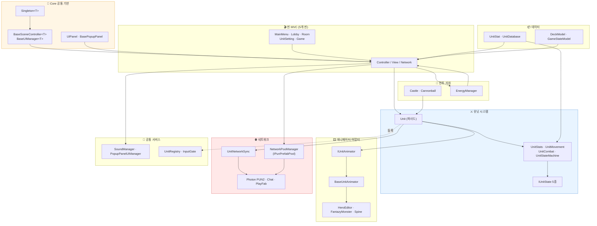

---

## 1. Core 공통 기반

모든 씬이 공유하는 기반 계층입니다. **Template Method 패턴**으로 초기화, 구독, 해제 순서를 강제해, 씬이 늘어나도 생명주기 처리 누락이 발생하지 않도록 했습니다.

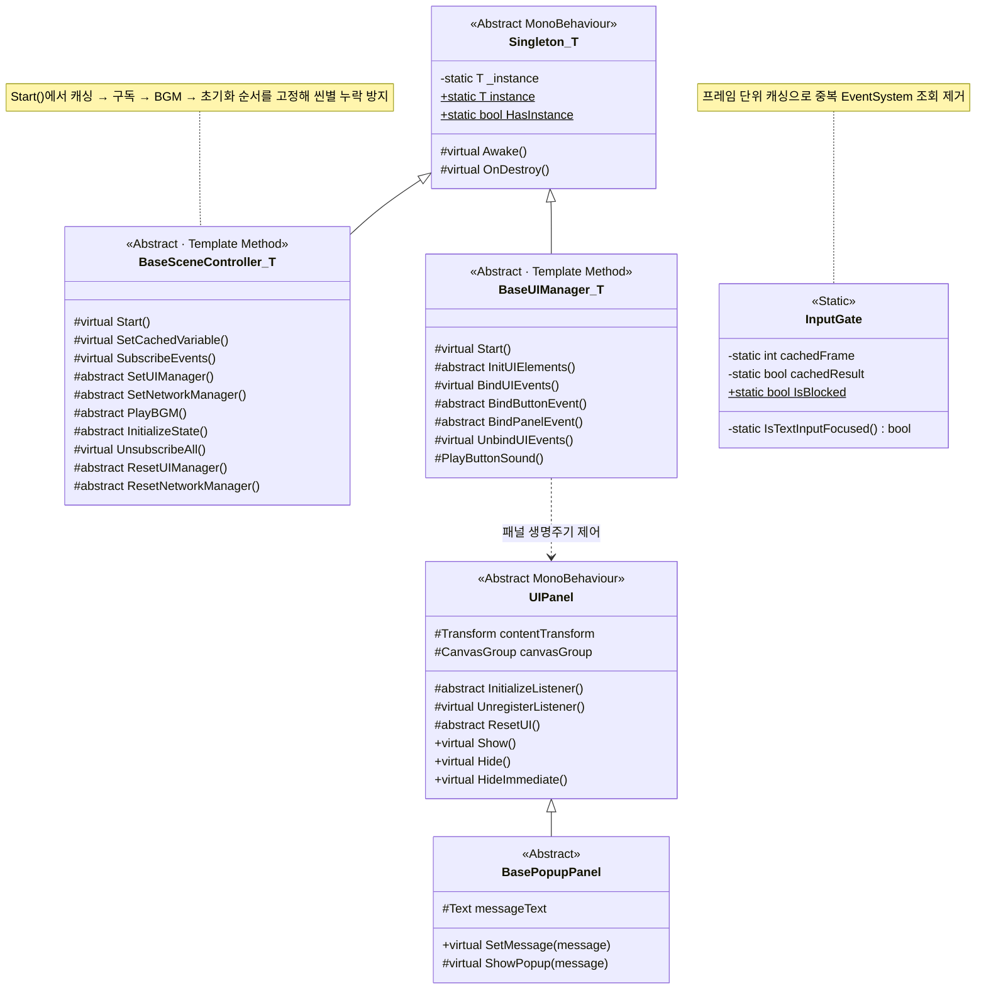

---

## 2. 씬 MVC 구조

5개 씬(MainMenu, Lobby, Room, UnitSetting, Game) 모두 동일한 3계층 구조를 따릅니다.
**Network는 Photon 콜백만 이벤트로 승격**하고, **UI는 화면 출력만** 담당하며, **로직과 상태는 Controller에만** 존재합니다.

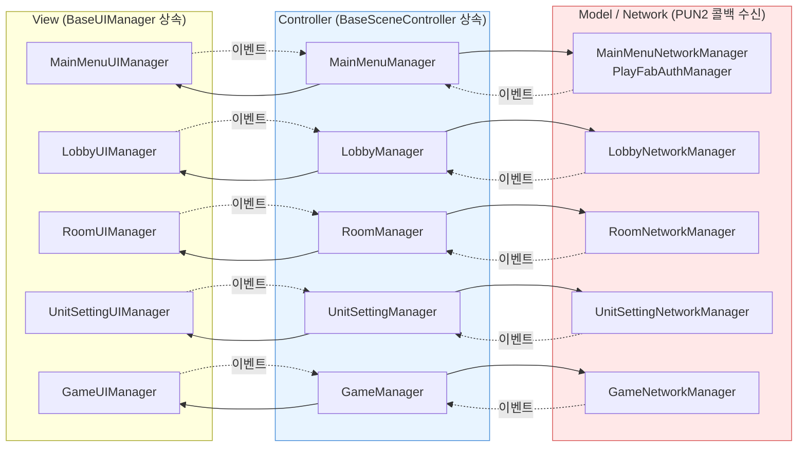

게임 씬 Controller를 예로 든 실제 구조입니다.

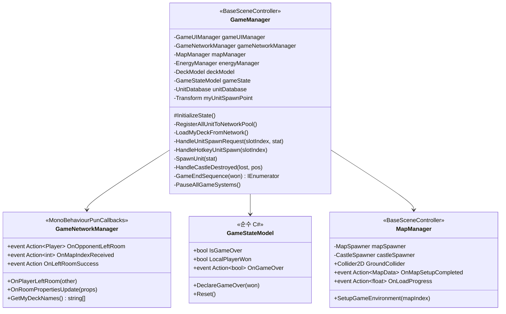

---

## 3. 유닛 시스템 (Component)

`Unit`은 로직을 직접 구현하지 않고 **기능별 컴포넌트에 위임하는 퍼사드**입니다.
`[RequireComponent]`로 필수 컴포넌트 누락을 컴파일 타임에 막고, `[DisallowMultipleComponent]`로 중복 부착을 차단합니다.

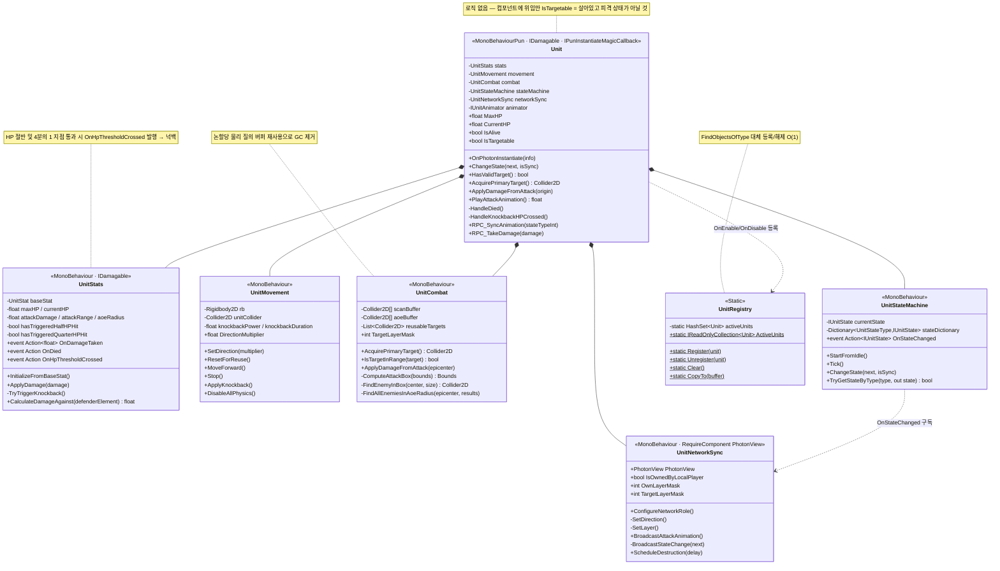

---

## 4. 유닛 상태 머신 (State)

행동을 `if` / `switch`가 아닌 **독립 클래스**로 분리했습니다. 상태를 추가할 때 기존 분기문을 수정할 필요가 없습니다.
각 상태는 `MonoBehaviour`가 아닌 `[Serializable]` 순수 클래스여서 인스펙터에서 내부 값을 그대로 관찰할 수 있습니다.

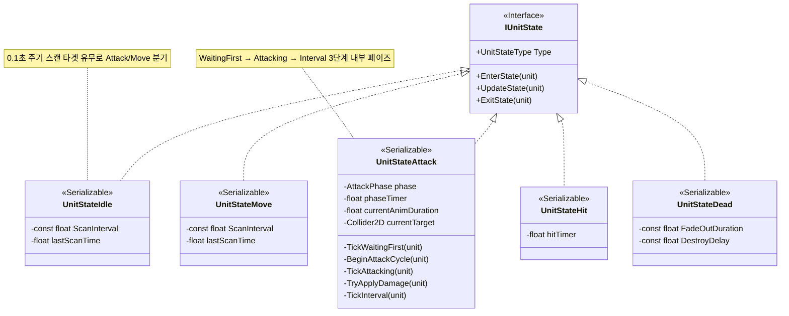

### 상태 전이 흐름

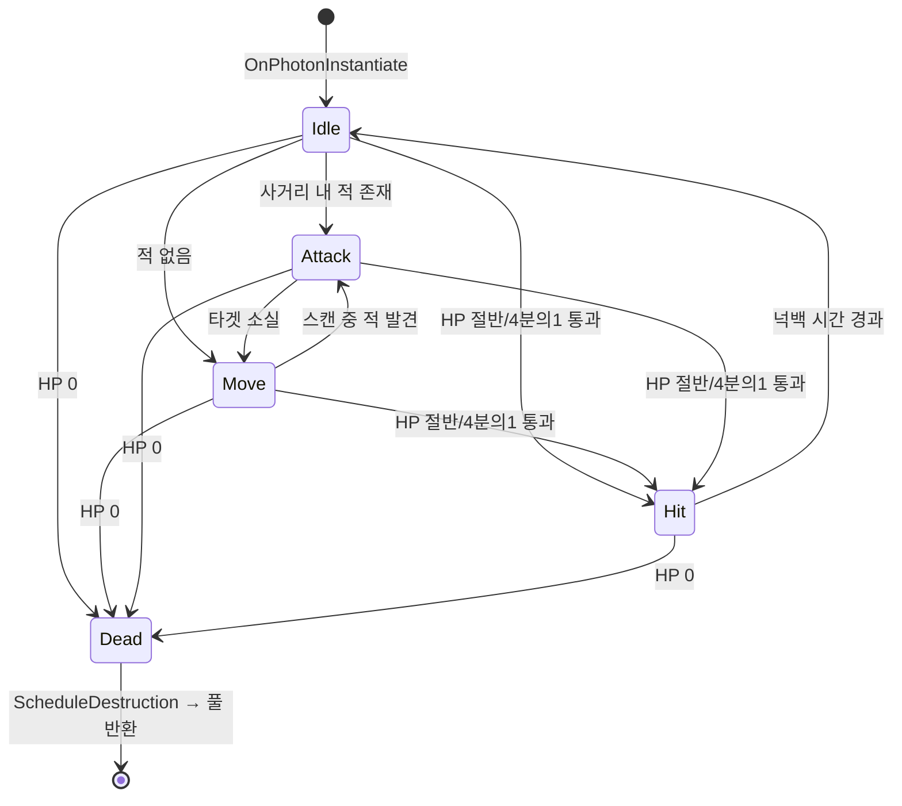

---

## 5. 애니메이터 계층 (Adapter)

리소스 한계로 **내부 API가 전혀 다른 3종의 서드파티 유닛 에셋**을 함께 사용해야 했습니다.
공통 인터페이스로 변환해, 유닛 시스템이 에셋 종류를 전혀 알지 못하도록 격리했습니다.

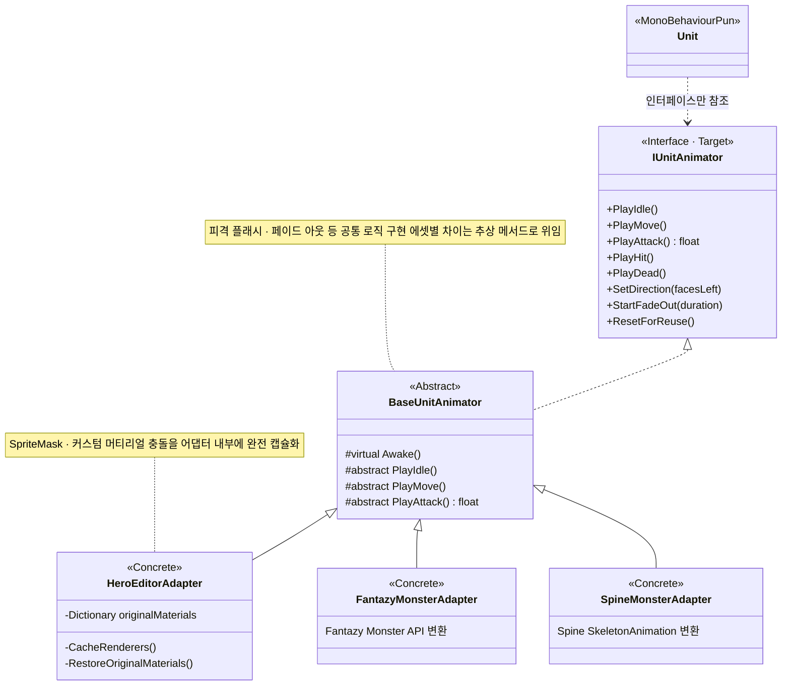

---

## 6. 네트워크 & 오브젝트 풀

Photon 의존성이 **`UnitNetworkSync`와 `NetworkPoolManager` 두 곳에만** 존재하도록 경계를 좁혔습니다.
상태 머신은 네트워크를 전혀 알지 못하고, 상태 변경 이벤트만 발행합니다.

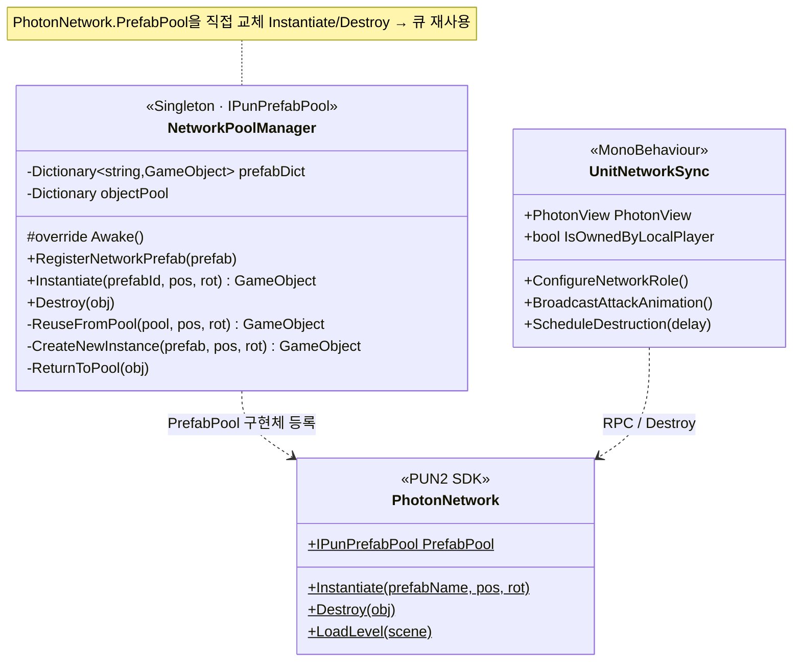

### 유닛 생성, 동기화, 소멸 경로

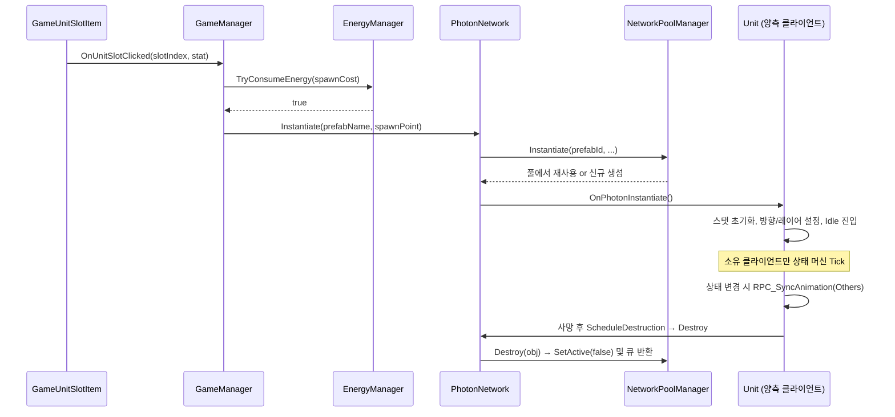

---

## 7. 데이터 계층

로직과 데이터를 분리해, **유닛 추가 시 코드 수정 없이 에셋 파일만 생성**하면 시스템에 반영되도록 했습니다(OCP).

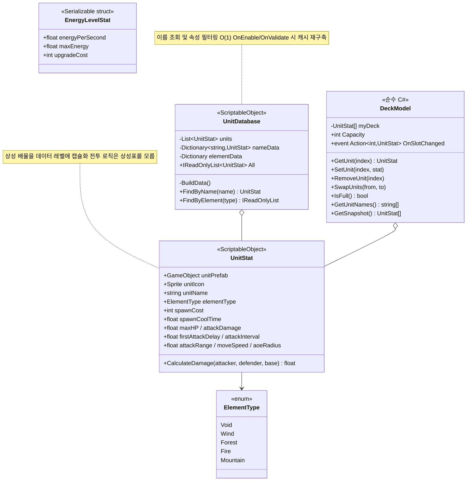

### 속성 상성 관계

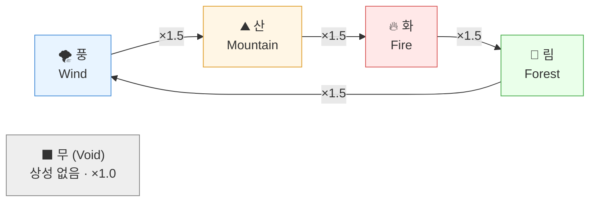

> 역방향은 `×0.75`가 적용되어, 상성 우위와 열세가 한 함수 안에서 함께 계산됩니다.

---

## 8. UI 계층 (Composite)

단일 컴포넌트와 복합 컨테이너를 동일한 방식으로 다뤄, 슬롯 개수와 무관하게 **최상위 Manager 한 곳에서 일괄 제어**합니다.

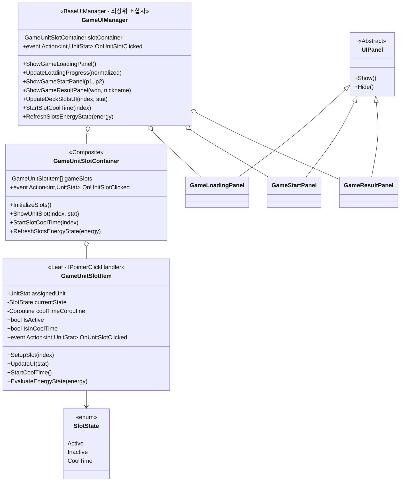

이벤트는 **Item → Container → UIManager → Controller** 순으로 버블링되어, 실제 데이터 변경은 Controller 계층에서만 일어납니다.

---

## 9. 채팅 시스템 (Strategy)

로비 채팅과 방 채팅은 **전송 방식이 완전히 다릅니다**(Photon Chat SDK vs. RPC 브로드캐스트).
전송을 인터페이스로 추상화해, `ChatController`는 구체 방식을 모른 채 씬에 따라 구현체만 교체됩니다.

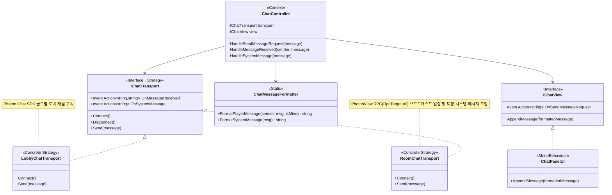

---

## 10. 성 & 대포 & 에너지

승패를 결정하는 `Castle`, 광역 견제 수단인 `Cannonball`, 유닛 소환 자원인 `EnergyManager`입니다.

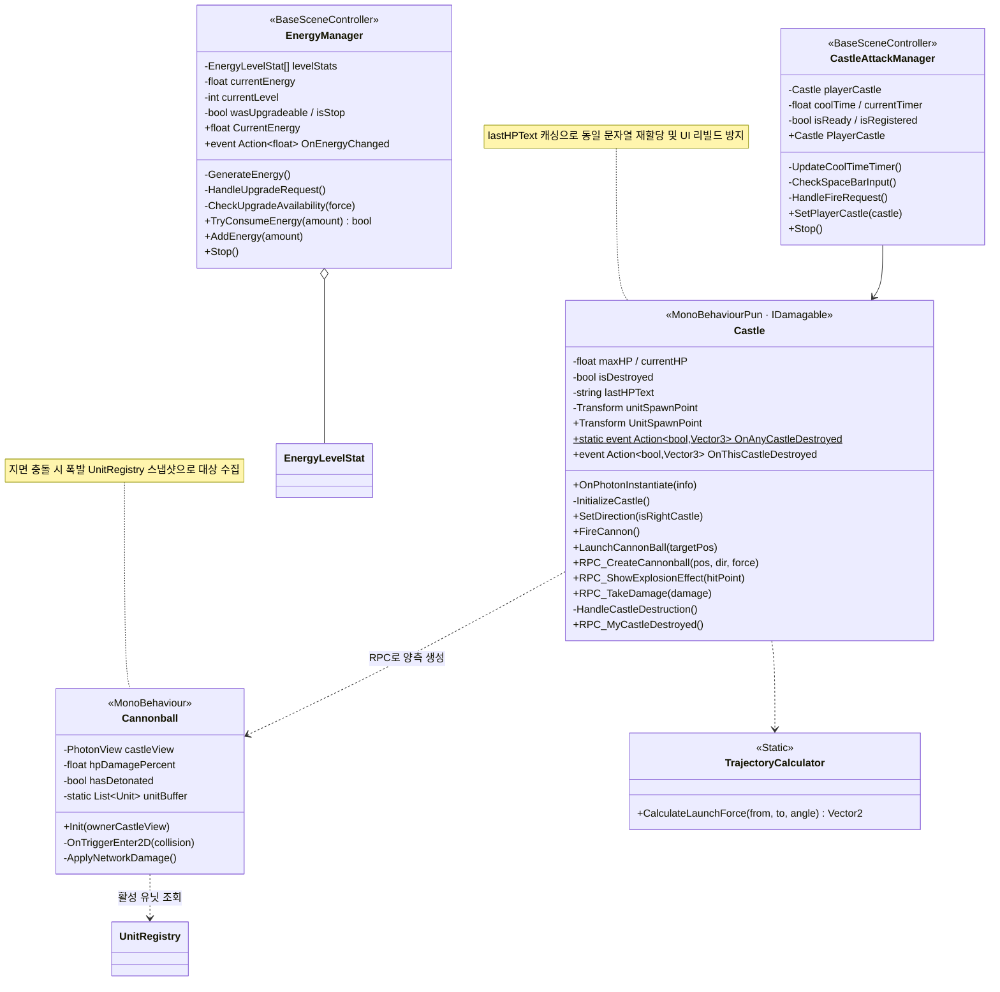

---

## 11. 이벤트 및 RPC 흐름

시스템 간 직접 참조를 최소화하기 위해 **C# 이벤트**로 내부를 연결하고, 클라이언트 간에는 **PUN2 RPC / CustomProperties**로 전파합니다.

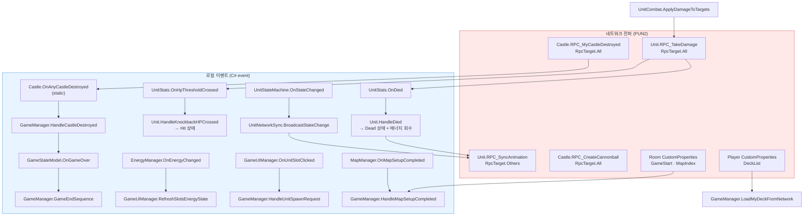

---

## 📋 설계 요약

| 계층 | 핵심 클래스 | 설계 의도 |
|---|---|---|
| **Core** | `Singleton<T>` → `BaseSceneController<T>` · `BaseUIManager<T>` | Template Method로 초기화, 구독, 해제 순서를 강제해 씬 확장 시 누락 방지 |
| **씬 MVC** | 5개 씬 × (Controller · UIManager · NetworkManager) | UI, 로직, 네트워크의 변경 이유를 분리해 수정 범위 최소화(SRP) |
| **유닛** | `Unit` + `UnitStats` · `UnitMovement` · `UnitCombat` · `UnitStateMachine` · `UnitNetworkSync` | God class 대신 컴포넌트 위임 — `Unit`은 퍼사드로만 존재 |
| **상태** | `IUnitState` 5종 + `Dictionary` 기반 전이 | 상태 추가 시 분기문 수정 불필요(OCP) · 조회 *O(1)* |
| **애니메이션** | `IUnitAnimator` → `BaseUnitAnimator` → Adapter 3종 | 내부 API가 다른 서드파티 에셋을 공통 인터페이스로 흡수 |
| **네트워크** | `UnitNetworkSync` · `NetworkPoolManager`(`IPunPrefabPool`) | Photon 의존을 두 클래스로 국소화 및 생성/파괴를 풀 재사용으로 대체 |
| **데이터** | `UnitStat` · `UnitDatabase` · `DeckModel` | ScriptableObject로 로직 및 데이터 분리, Dictionary 캐시로 조회 *O(1)* |
| **UI** | `GameUIManager` → `Container` → `Item` | Composite로 슬롯 개수와 무관하게 단일 진입점 제어 |
| **채팅** | `ChatController` + `IChatTransport` 구현 2종 | Strategy로 전송 방식만 교체(Context 코드 수정 없음) |
| **공통 유틸** | `UnitRegistry`(HashSet) · `InputGate`(프레임 캐싱) | 선형 탐색과 중복 조회를 자료구조와 캐싱으로 제거 |

> **설계 한계**: 본 프로젝트는 학습 목적의 **클라이언트 권위 구조**입니다. 각 클라이언트가 계산한 피해량을 RPC로 전파하므로 서버 검증이 없어 치팅에 취약합니다. 상용 수준에서는 서버가 판정을 수행하고 클라이언트는 입력만 전송하는 구조로 전환해야 함을 인지하고 있습니다.
